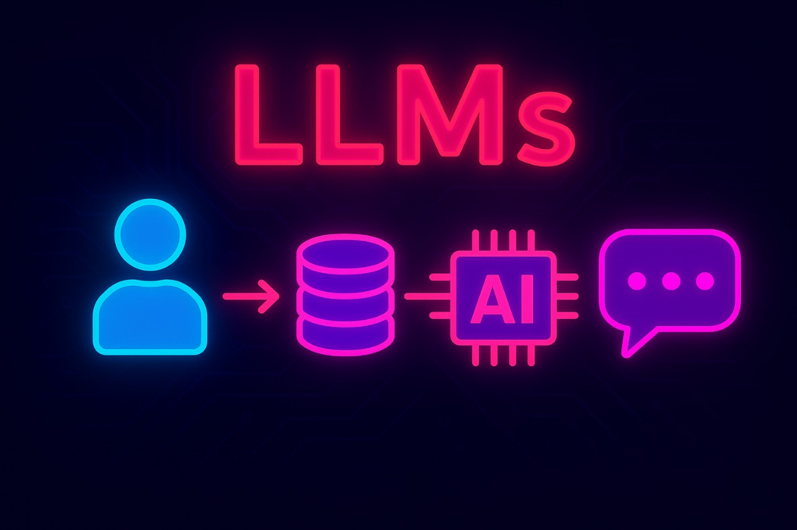
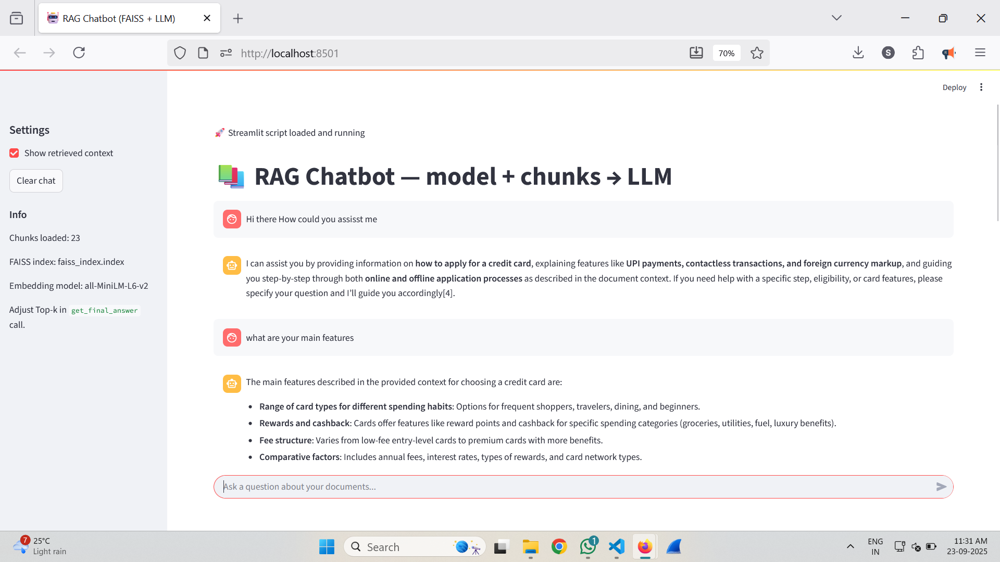

# HDFC Credit Card RAG Assistant

## Overview

The **HDFC Credit Card RAG Assistant** is an AI-powered chatbot designed to help users get personalized guidance on HDFC credit cards, including eligibility, benefits, fees, and application processes. This project leverages a **Retrieval-Augmented Generation (RAG)** approach to provide accurate, context-aware answers.

The system works as follows:

1. **Data Upload:** Users upload relevant documents or FAQs about HDFC credit cards.
2. **Vectorization:** The system converts the uploaded data into embeddings (vectors).
3. **Indexing:** A FAISS index is created for efficient similarity search.
4. **Retrieval:** The top-k relevant chunks of data are retrieved based on user queries.
5. **Refinement:** A language model (LLM) processes the retrieved chunks to generate coherent, contextual answers.
6. **Frontend:** Streamlit-based UI allows users to interact with the assistant in real time.




---

## Features

* Upload multiple data files (PDF, TXT, CSV) related to HDFC credit cards.
* Automatically chunk and vectorize the content.
* Efficient similarity search using FAISS index.
* Context-aware answers refined by a language model.
* Streamlit frontend for easy interaction.
* Configurable top-k retrieval for precise results.

---

## Requirements

* Python 3.8+
* [Streamlit](https://streamlit.io/)
* [FAISS](https://github.com/facebookresearch/faiss)
* [Sentence Transformers](https://www.sbert.net/)
* Additional libraries: `numpy`, `pandas`, `pickle`, `requests`

Install dependencies:

```bash
pip install streamlit faiss-cpu sentence-transformers numpy pandas pickle5 requests
```

---

## Project Structure

```
hdfc_rag_assistant/
│
├── app.py               # Streamlit frontend
├── data/                # Folder for uploaded documents
├── models/              # Saved LLM and vector models
├── faiss_index.index    # FAISS index file
├── hdfc.pkl             # Pickled chunked data
├── requirements.txt
└── README.md
```

---

## Usage

### 1. Run Streamlit Frontend

```bash
streamlit run app.py
```

### 2. Upload Data

* Upload PDFs, CSVs, or TXT files containing HDFC credit card FAQs or documentation.

### 3. Create Vectors and Index

* The system automatically splits the text into chunks, generates embeddings using `SentenceTransformer`, and creates a FAISS index for similarity search.

### 4. Ask Questions

* Enter your query in the Streamlit interface.
* The system retrieves top-k relevant chunks and refines the response through the LLM.

### 5. Receive Answer

* The assistant provides a clear, contextual answer directly in the frontend.

---

## Example

**Query:** “What is the eligibility criteria for HDFC Regalia credit card?”
**RAG Output:**

* Top 5 matching chunks retrieved from uploaded data
* Refined answer generated by LLM:

> “To apply for the HDFC Regalia credit card, you must be aged 21-65 years, have a minimum annual income of ₹12 lakh, and hold a good credit score.”

---

## Notes

* Ensure uploaded data is clean and well-structured for best results.
* You can adjust `top_k` in `app.py` to retrieve more or fewer chunks.
* The LLM refinement ensures coherent and contextually correct answers.

---

## License

This project is for educational and personal use. Commercial use requires permission from the author.

---

