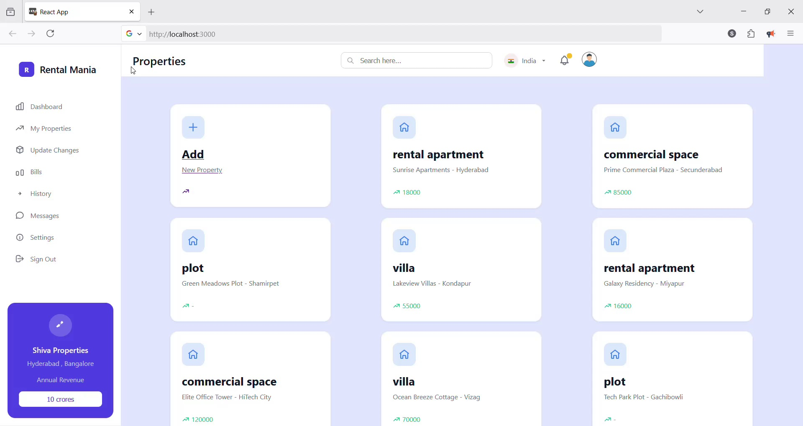
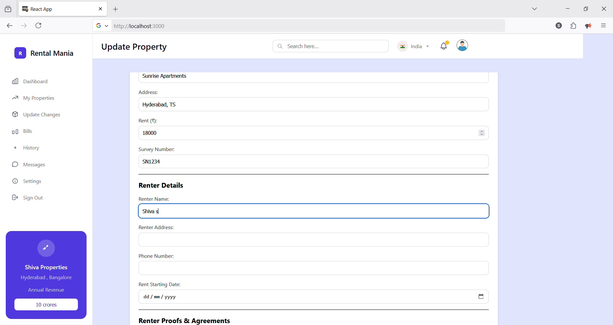
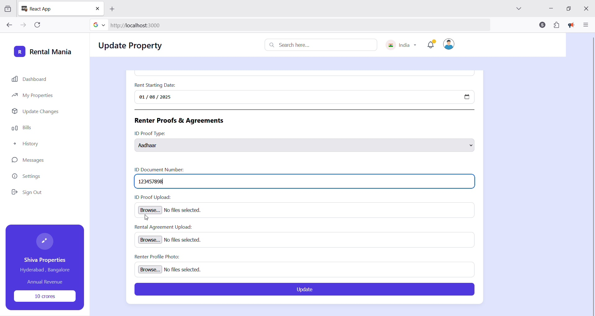
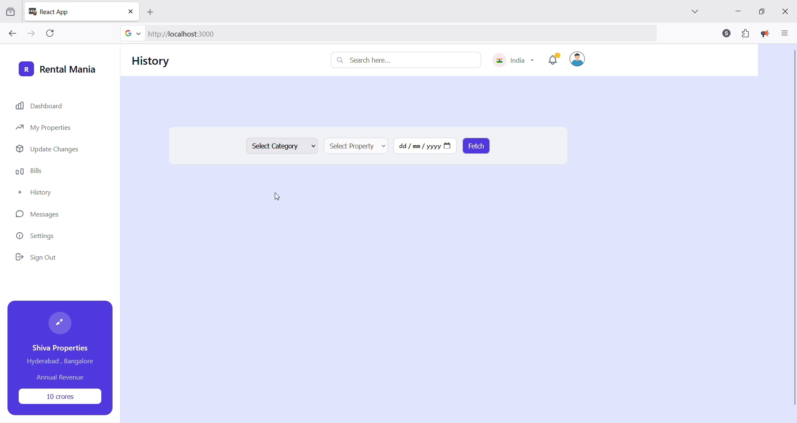
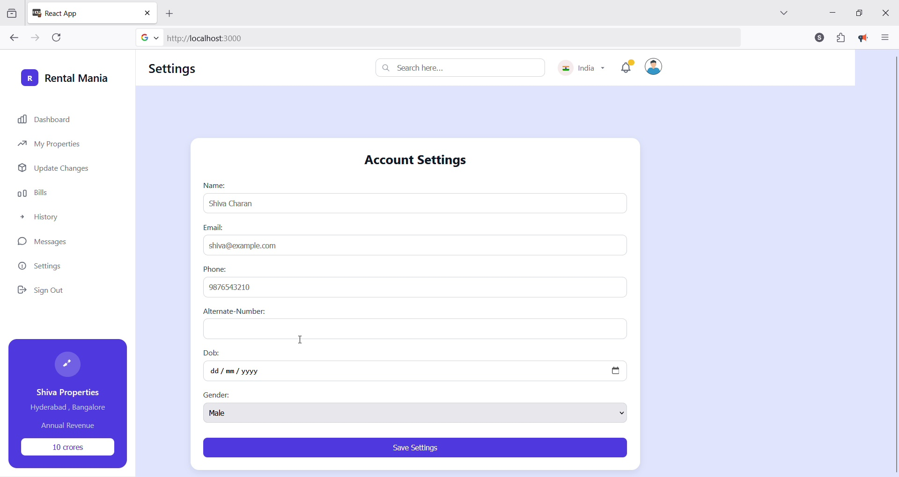

# 🏠 Property Management Dashboard

This React-based web application simplifies and streamlines property management. It allows users to manage a list of properties, update renter details, view update history, and maintain user profiles. The interface is intuitive and designed for landlords or property managers to efficiently handle operations.

---

## 🎯 Features Demonstrated in the Application

### 📋 1. View All Listed Properties
- Displays a table/grid of all properties managed in the system.
- Includes details like property ID, location, rent status, tenant info, etc.
- 

### 🏘️ 2. Update Renter Information
- Modify existing tenant or renter details for selected properties.
- Helps ensure renter data is always accurate and up-to-date.
- 

### 🛠️ 3. Apply Changes to Property
- Make updates to property attributes and save them to the system.
- Ensures the most recent configurations are reflected.
- 

### 🕓 4. Fetch Property History
- View the chronological history of changes made to properties.
- Useful for auditing or verifying past updates.
- 

### 👤 5. Update User Profile
- Users can edit their personal profile including name, contact details, and other settings.
- Enhances personalization and access control.
- 

---

## 🛠️ Tech Stack

- **Frontend**: React.js, JSX, JavaScript
- **Styling**: CSS (or Tailwind/Bootstrap if used)
- **State Management**: Context API or Redux (if used)
- **API Handling**: Axios or Fetch

---

## 📦 Installation

```bash
git clone https://github.com/your-username/property-dashboard.git
cd property-dashboard
npm install
npm start
