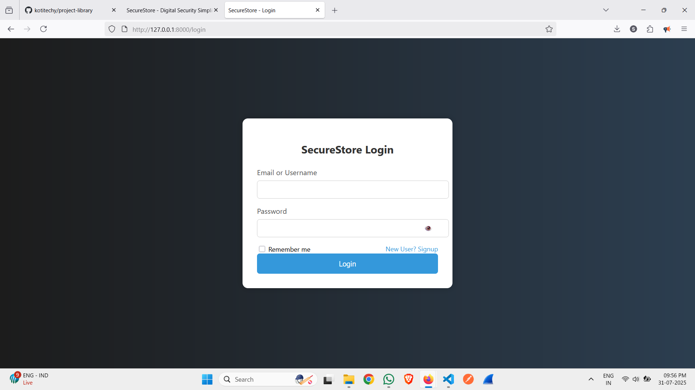
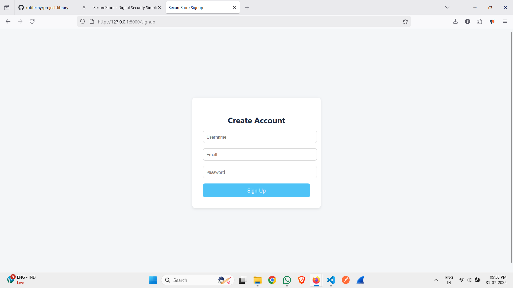
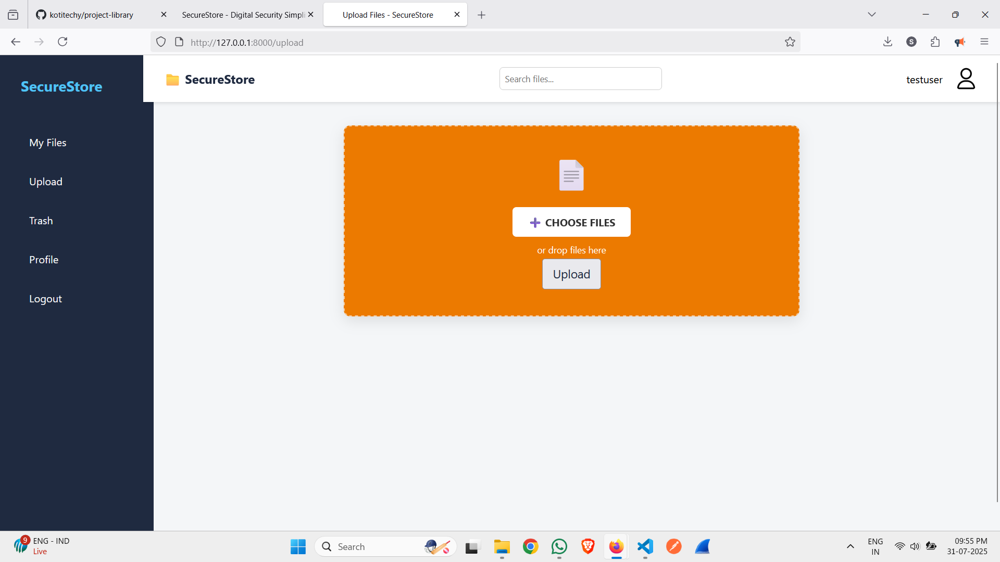
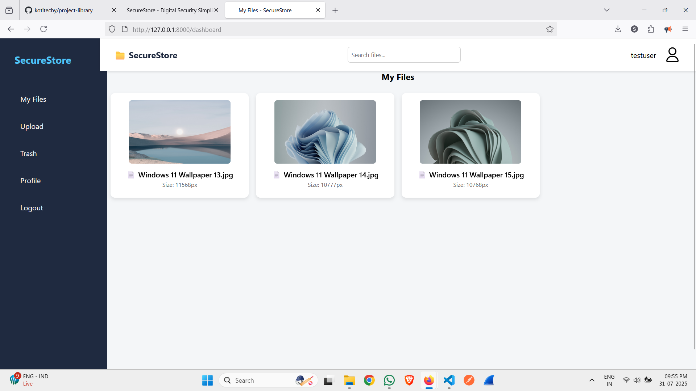
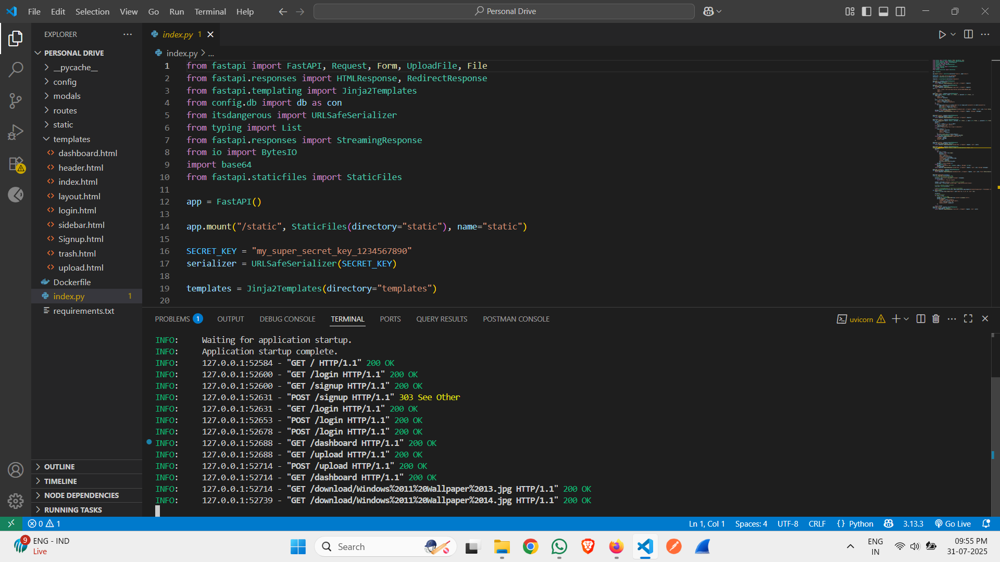

# 🖼️ FastAPI File Manager App

A full-stack web application built using **FastAPI** and **MongoDB** for secure user registration, login, image upload, file display, and download.

## 🌐 Features

- 🔐 User Authentication (Login & Signup)
- 📁 File Upload (Multiple files supported)
- 🖼️ Display uploaded images directly
- 📥 Download files
- 🧾 View uploaded file metadata (size, type, etc.)
- 🗑️ Trash page (UI placeholder)
- 🧪 Built with FastAPI, Jinja2, and MongoDB

---

## 🚀 Tech Stack

- **Backend:** FastAPI
- **Database:** MongoDB
- **Frontend:** Jinja2 (HTML templating)
- **Others:** HTML5, CSS3, Bootstrap (for styling), base64 (for image preview)

---

## 🖥️ Screenshots

### 🏠 Index Page


### 🔐 Login Page


### 📝 Register Page


### 🖼️ Upload Files Page


### 📂 Display Files Page


### ⚙️ Run (Code view)


---

## ⚙️ How to Run

### 🔧 Prerequisites

- Python 3.8+
- FastAPI
- Uvicorn
- pymongo
- Jinja2
- MongoDB running locally or on Atlas

### 📦 Installation

```bash
# Clone the repository
git clone https://github.com/yourusername/fastapi-file-manager.git
cd fastapi-file-manager

# Install dependencies
pip install -r requirements.txt

# Run the FastAPI app
uvicorn main:app --reload
